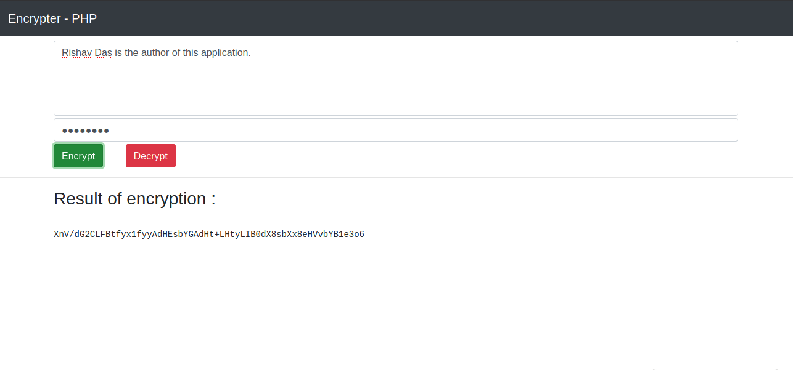

# Encrypter - PHP

This tool named "Encrypter" is used in encryption and decryption of string supplied with password protection. Written in PHP. The whole programming functionality of the tool is written in PHP, and the frontend part includes HTML and CSS for the web page structuring. We also relied on BootStrap CDN for the frontend designing part.
Here is a screenshot of the working model of this application (tool)

## Note

Some key points about this tool / project are listed below, read through them.

* __Basic Programming :__ The web application is made using very basic programming concepts, even though the concept of encryption is also made simple here. Very easy PHP terms are used to make this tool. This makes this project an absolute to make project for all the beginners in PHP programming and web developement.

* __Just PHP :-__ Yes we use only one technology in the backend and that is just the PHP server. We don't need a MySQL database server running or NGINX proxies running around, we can go with just the php localhost for this project.

 __Youtube Tutorials :-__ Yes, you've read it right! We have the tutorials of making this web application (OR you can call project), uploaded at [my youtube channel](https://www.youtube.com/channel/UCfp-xR7cpyLOXVW8MYr59WA). You can check it out and get a practical experience of the things that are being done on the screen.

* __Contributing :-__ If you find any flaws in the codes and the structure of the source files, you are free to modify them according to your choice. If you want to submit your edits on this project, you can either pull a git request, or you can simply mail me the edits and your views at _rdofficial192@gmail.com_. I will surely check your view. 

## About author

The application is written by Rishav Das. I am a programmer and know python (django, general based, data science), javascript (nodeJs), PHP, C, C++. I have written this tool in intention to expertise the javascript language for the beginners. The tool does not need you to learn any server side programming or any sockets / nodes stuff. If you are new to javascript, here is your first project to start off ;-). I have made several beginner level javascript projects and all are available at my [github profile](https://github.com/rdofficial). One more thing about these projects are that the tutorials of making these projects including coding section, mathematical section are uploaded to [my youtube channel](https://www.youtube.com/channel/UCfp-xR7cpyLOXVW8MYr59WA). If you haven't checked out my videos, check them out on my channel, you would get a better practical experience for the projects.

For the contributors, if you want to update any stuff on these projects, you can just create a pull request or just mail me at _rdofficial192@gmail.com_ with the updates. I'll check it out as soon as possible.
